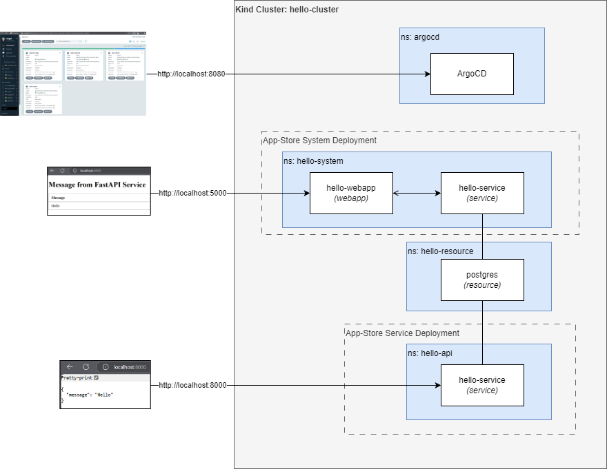

# App Deploy Example

This repository contains an example project to demonstrate application deployment workflows. It includes an example service and webapp. It includes the deployment manifest demonstrating deploying a service (just the api) and a system that includes the service and webapp. 

There is a powershell script that uses kind to setup a local cluster, installs and sets up argocd adding the root app-store application to simulate app store deploy approach.

## Prerequisits
Docker and Kind must be installed on the machine.

## Running
Run the ./start.ps1 script located in the ./scripts directory (i.e., cd scripts -> start.ps1) which will

###
- Starts a local kind cluster, deleting an esiting cluster if it exists
- Builds the container images for hello-service and hello-webapp
- Adds the containers to the kind cluster
- Installs ArgoCD
- Creates the root app-store argo app (simulates be the cluster app created by RDOE)
- Exposes the ArgoCD port on 8080 via port forwarding
- Exposes the WebApp(App Store System Deployment) port on 5000 via port forwarding
- Exposes the Service (App Store Service Deployment) port on 8000 via port forwarding

Once the script has completed it will provide the username and password for ArgoCD 

- ArgoCD via http://localhost:8080
- Hello-Webapp via http://localhost:5000 (Example App Store System Deployment)
- Hello-Service (called fastapi) via http://localhost:8000 (Example App Store Service Deployment)
 
 
## Clean Up
To clean up the environment simply run: stop.ps (deletes the kind cluster hello-cluster)
